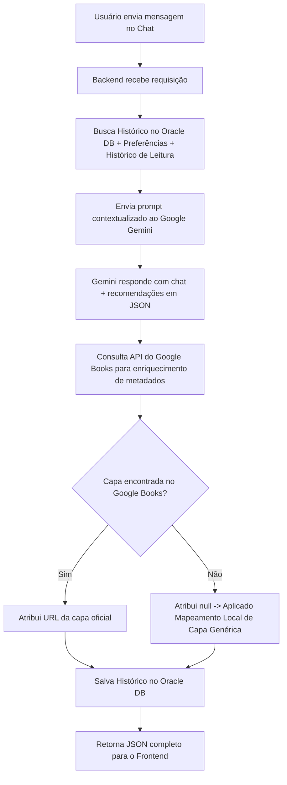
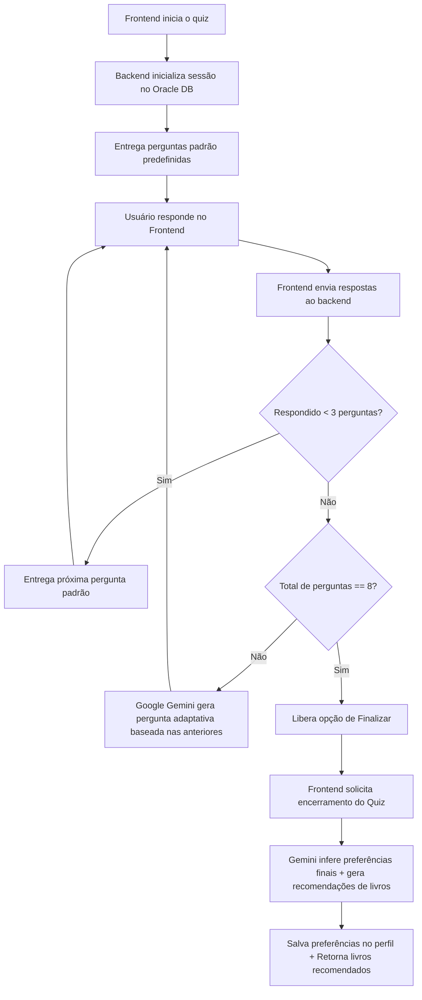
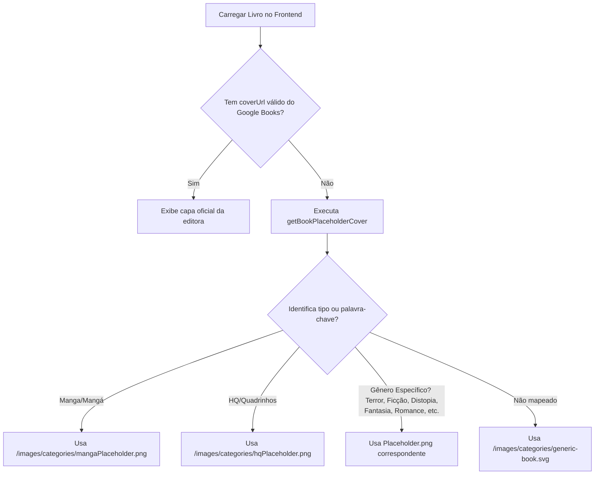

# 📚 Entre Páginas — Plataforma Inteligente de Recomendação Literária com IA

> **Projeto Integrador V (PUC-Campinas)**
> Uma plataforma robusta e de alta performance que utiliza Inteligência Artificial para recomendar livros, HQs e mangás de forma personalizada, adaptando-se em tempo real ao perfil, histórico e preferências de leitura do usuário.

---

<div align="center">

[](https://nodejs.org/)
[](https://expressjs.com/)
[](https://www.oracle.com/database/)
[](https://ai.google.dev/)
[](https://vuejs.org/)
[](https://vuetifyjs.com/)
[](https://tailwindcss.com/)
[](https://pptr.dev/)

</div>

---

## 🚀 Principais Diferenciais e Funcionalidades

O **Entre Páginas** oferece uma experiência literária imersiva e inteligente por meio das seguintes inovações:

*   🤖 **Recomendação Literária Contextualizada com IA**: Chatbot integrado à API do Google Gemini que gera sugestões personalizadas em tempo real com base no perfil de preferências e no histórico de leitura do usuário salvo no banco de dados.
*   🧠 **Quiz Adaptativo Dinâmico (RF10)**: Um questionário interativo inteligente de até 8 perguntas que inicia com critérios gerais e se adapta dinamicamente nas etapas seguintes utilizando IA, cruzando as escolhas do usuário com o acervo literário.
*   🛡️ **Arquitetura de Catálogo Resiliente com Proxy**: Mitigação automática de bloqueios ou rate limits (Erro HTTP 429) da API pública do Google Books. O backend conta com um catálogo local curado de alta fidelidade e uma rota de proxy (`GET /books/:id`) que unifica e garante o carregamento estável do catálogo e dos detalhes.
*   🖼️ **Fallbacks Inteligentes de Imagens**: Lógica avançada de imagens no frontend para exibir capas dinâmicas e esteticamente agradáveis hospedadas no Unsplash caso a API do Google Books não forneça capas válidas.
*   ⚠️ **Classificação de Conteúdo Sensível (RF11)**: Detecção automática de temas sensíveis (violência, saúde mental, etc.) pela IA, aplicando tags de aviso e ocultando visualmente capas/detalhes no frontend até a confirmação de exibição pelo usuário.
*   🔐 **Autenticação JWT Segura e Rate Limiting**: Sessão protegida via token JWT único, middlewares de segurança (Helmet) e controle estrito de requisições por IP nas rotas sensíveis e de autenticação.
*   📬 **Recuperação de Senha Integrada**: Fluxo completo de redefinição de credenciais via e-mail utilizando SMTP e suporte local para testes com o Mailpit.
*   📸 **Automação Puppeteer para Slides**: Suíte automatizada capaz de rodar os fluxos da plataforma de ponta a ponta e exportar 15 capturas de tela em alta definição para slides de apresentação.

---

## 📊 Arquitetura de Software e Fluxos de Processo

Abaixo estão detalhados os fluxogramas que descrevem a engenharia por trás das integrações de IA, resiliência de dados e fallbacks de interface da plataforma.

### 1. Fluxo de Chat de Recomendação Literária com IA
O chatbot utiliza a API do Google Gemini com um histórico contextualizado para retornar recomendações de alta qualidade, enriquecendo-as secundariamente com a API do Google Books.



### 2. Quiz Adaptativo de Recomendação (RF10)
A dinâmica inteligente do quiz começa com perguntas estáticas e se adapta de forma dinâmica nas rodadas subsequentes, cruzando as respostas com a inteligência do Gemini.



### 3. Resolução e Fallback de Capas de Livros
Para garantir que a plataforma nunca quebre o visual por falta de imagens na API do Google Books, implementamos uma lógica de fallbacks robusta no frontend utilizando os novos placeholders de categoria.



---

## ⚙️ Configuração do Ambiente e Instalação

### Pré-requisitos

*   **Node.js**: Versão 18 ou superior instalada localmente.
*   **Banco de Dados**: Oracle Autonomous Database (ou banco compatível) configurado.
*   **Wallet do Oracle Autonomous Database** disponível localmente.
*   **Chave de API do Google Gemini**.

### 1. Preparação das Variáveis de Ambiente
Copie o modelo de ambiente padrão na raiz do projeto:

```bash
cp .env.example .env
```
*(No Windows PowerShell, execute: `Copy-Item .env.example .env`)*

Preencha os valores reais no arquivo `.env` gerado.

---

### 🗄️ Conexão e Configuração do Banco de Dados Oracle

Para conectar ao Autonomous Database em nuvem, siga os passos abaixo:

1.  **Baixe a extensão** ou utilize o software **Oracle SQL Developer**.
2.  **Credenciais de Acesso**: Username e Senha estão disponíveis em nossos canais internos confidenciais.
3.  **Tipo de Conexão**: Selecione a opção **Cloud Wallet**.
4.  **Arquivo da Wallet**: Utilize o arquivo criptografado `Wallet_ProjetoIntegradorV.zip`.
    *   ⚠️ **IMPORTANTE:** NUNCA faça o upload ou commit deste arquivo no GitHub!
5.  **Serviço (Service)**: Selecione a opção **HIGH** para garantir máxima performance.

#### Preparando a Wallet localmente para o Backend:
Descompacte a Wallet do Oracle Database em uma pasta específica:

```bash
cd secrets/oracle-wallet
unzip Wallet_ProjetoIntegradorV.zip -d Wallet_ProjetoIntegradorV
```

Crie a estrutura de tabelas executando o comando de setup na raiz do projeto:

```bash
npm run db:setup
```
*Esse comando irá verificar e criar todas as tabelas necessárias (`CONVERSAS`, `PREFERENCIAS_USUARIO`, `SUGESTOES_CONVERSA`, `FAVORITOS`, `QUIZ_SESSOES`, `PASSWORD_RESET_TOKENS`, `AVALIACOES`).*

---

### 📬 Executando o Mailpit (SMTP de Testes Local)

O Mailpit captura de forma transparente todos os e-mails enviados pelo backend (recuperação de senha e confirmação de cadastro) sem disparar e-mails para caixas postais reais.

#### Opção A: Usando Docker (Recomendado)
```bash
docker run -d --name mailpit -p 1025:1025 -p 8025:8025 axllent/mailpit
```

#### Opção B: Instalação Manual (sem Docker)
*   **Windows (via Scoop)**: `scoop install mailpit` e depois execute `mailpit`
*   **macOS (via Homebrew)**: `brew install mailpit` e depois execute `mailpit`
*   **Download direto**: Baixe a versão correspondente no [GitHub Releases do Mailpit](https://github.com/axllent/mailpit/releases), descompacte e execute o executável.

Acesse o painel web para visualização dos e-mails em: [http://localhost:8025](http://localhost:8025).

---

### ⚡ Inicialização da Aplicação

#### 1. Instale as dependências na raiz e na pasta do frontend:
```bash
npm install
cd frontend && npm install && cd ..
```

#### 2. Execute a aplicação completa (Backend + Frontend) em modo de desenvolvimento:
```bash
npm run dev:all
```
*   **Backend** disponível em: `http://localhost:3000`
*   **Frontend** disponível em: `http://localhost:3001` (ou na porta atribuída pelo Vite)

---

## 🛠️ Scripts Disponíveis no Ecossistema

### Scripts do Backend (Raiz do Projeto)

| Comando | Descrição |
|---|---|
| `npm run dev` | Inicia o servidor do backend em modo desenvolvimento. |
| `npm run dev:all` | Inicia o backend e o frontend simultaneamente com logs unificados. |
| `npm start` | Inicia o servidor em ambiente de produção. |
| `npm run seed:user` | Cria ou atualiza um usuário administrativo/teste no banco Oracle. |
| `npm run db:setup` | Cria e verifica todas as tabelas principais do projeto de forma sequencial. |
| `npm run db:chat` | Cria/verifica a tabela `CONVERSAS` no Oracle DB. |
| `npm run db:preferences` | Cria/verifica as tabelas `PREFERENCIAS_USUARIO`, `SUGESTOES_CONVERSA` e `FAVORITOS`. |
| `npm run db:quiz` | Cria/verifica a tabela `QUIZ_SESSOES` no Oracle DB. |
| `npm run db:password-reset` | Cria/verifica a tabela `PASSWORD_RESET_TOKENS` no Oracle DB. |
| `npm run db:avaliacoes` | Cria/verifica a tabela `AVALIACOES` no Oracle DB. |
| `npm test` | Executa os testes unitários integrados com o test runner nativo do Node.js. |
| `npm run test:chat` | Executa os testes HTTP de fluxo de chat de recomendação com a API no ar. |
| `npm run test:quiz` | Executa os cenários de teste do fluxo adaptativo de quiz com a API no ar. |
| `npm run test:quiz:run` | Inicializa tabelas, sobe a API caso necessário e roda a suite de testes do quiz. |
| `npm run chat:play` | Permite interagir e conversar com o chatbot diretamente pelo terminal de comandos. |
| `npm run screenshots` | Executa a suite automatizada de capturas de tela do Puppeteer para slides de apresentação. |

### Scripts do Frontend (Pasta `/frontend`)

| Comando | Descrição |
|---|---|
| `npm run dev` | Inicializa o servidor Vite para o frontend local. |
| `npm run build` | Valida tipos e compila a build de produção otimizada. |
| `npm run type-check` | Executa a validação de tipos de compilador TypeScript/Vue. |
| `npm run test` | Executa a suíte de testes unitários do frontend utilizando o Vitest. |
| `npm run lint` | Analisa a qualidade de código utilizando ESLint. |

---

## 🔒 Arquitetura de Segurança, Autenticação e Resiliência

### Mecanismo de Autenticação (JWT)
*   A plataforma implementa autenticação baseada em tokens **JWT (JSON Web Tokens)** assinados digitalmente com `JWT_SECRET` e tempo de expiração (`JWT_EXPIRES_IN`).
*   No frontend (Vue.js), as rotas protegidas são blindadas utilizando `meta.requiresAuth` no Vue Router.
*   Usuários sem token ativo no `localStorage` são automaticamente interceptados e redirecionados para `/login`, enquanto usuários logados que tentam acessar `/login` ou `/register` são encaminhados para a Home (`/`).

### Arquitetura de Resiliência do Catálogo
Para anular completamente os limites severos de requisição da API do Google Books que geravam erros HTTP 429 nos navegadores dos clientes, implementamos uma resiliência robusta de três camadas:
1.  **Catálogo Local de Alta Fidelidade**: O backend armazena uma base curada local contendo livros populares, HQs e mangás de diversos gêneros que servem como fallback transparente em caso de instabilidade na API pública.
2.  **Proxy de API (`GET /books/:id`)**: O frontend nunca consome APIs externas diretamente. Todas as requisições por detalhes passam obrigatoriamente pela rota proxy `/books/:id` no backend, centralizando o tráfego sob a cota estável do servidor.
3.  **Hospedagem Estética de Capas**: Imagens de fallback e placeholders do sistema são servidos através de CDN e conexões estáveis no Unsplash, garantindo carregamentos rápidos e visual livre de erros.

### Segurança da API
O backend Express aplica os seguintes middlewares de segurança na inicialização:
*   `helmet()` para cabeçalhos de segurança HTTP.
*   `express-rate-limit` global e controles estritos específicos para rotas sensíveis de cadastro e autenticação (`/auth/register`, `/auth/login`, `/auth/forgot-password`, `/auth/reset-password`).
*   Configuração de payloads de requisição limitados a `10mb` via `JSON_BODY_LIMIT`.

---

## 🤖 Integração com Inteligência Artificial (Google Gemini)

O ecossistema consome o modelo `gemini-2.5-flash-lite` (configurado via `GEMINI_MODEL`), estruturando prompts avançados que forçam respostas no formato JSON estruturado e tratam temas sensíveis na origem.

### Fluxo de Criação de Conta e Cadastro
O script `seed:user` facilita a inserção ágil de contas no banco para testes automatizados e demonstrações:

```bash
npm run seed:user -- --email=admin@example.com --password=123456
```
*(O script realiza a operação de `MERGE` no OracleDB, garantindo a atualização segura caso o e-mail já exista).*

---

## 🛠️ Endpoints Principais da API

Todas as rotas indicadas com 🔐 exigem o cabeçalho de autenticação: `Authorization: Bearer <token_jwt>`.

### 🔑 Autenticação e Credenciais
*   `POST /auth/register`: Cadastro de novo usuário.
*   `POST /auth/login`: Login de credenciais (retorna Token JWT).
*   🔐 `GET /auth/me`: Retorna os dados do usuário autenticado no momento.
*   `POST /auth/forgot-password`: Solicita token de recuperação de senha por e-mail.
*   `POST /auth/reset-password`: Redefine a senha utilizando o token recebido no e-mail.

### 💬 Chatbot de Recomendação
*   🔐 `POST /chat/message`: Envia uma mensagem e recebe resposta com recomendações enriquecidas em JSON.
*   🔐 `GET /chat/history`: Retorna o histórico de conversas salvo no Oracle.
*   🔐 `DELETE /chat/history`: Limpa o histórico de mensagens.
*   🔐 `POST /chat/close`: Encerra a sessão de chat, analisa gostos, salva as preferências inferidas no banco OracleDB e atualiza o perfil.
*   🔐 `GET /chat/preferences` e `PUT /chat/preferences`: Gerenciamento manual do perfil de preferências literárias do usuário.

### 🧠 Quiz Adaptativo (RF10)
*   🔐 `POST /quiz/start`: Inicializa uma nova sessão de Quiz e entrega as primeiras perguntas gerais.
*   🔐 `POST /quiz/answer`: Envia a resposta de uma questão e recebe a próxima pergunta (adaptativa a partir da 3ª rodada).
*   🔐 `POST /quiz/finish`: Encerra o quiz, processa o perfil do usuário na IA e retorna as obras correspondentes.

### 📚 Catálogo e Avaliações
*   `GET /books`: Retorna o catálogo geral com filtros de busca, paginação, tipo (HQ, Mangá, Livro) e mitigação local.
*   `GET /books/:id`: Rota de proxy para retornar detalhes completos de uma obra de forma resiliente.
*   🔐 `GET /avaliacoes` e `POST /avaliacoes`: Recupera ou envia avaliações (com nota de 1 a 5 e comentários) de livros específicos salvos no Oracle Database (operação de *upsert*).

---

## 🧪 Testes, Automação e Validação

### Testes do Backend
Execute a suíte de testes unitários do Node.js:
```bash
npm test
```

Execute a suíte de integração de fluxos e validações completas de endpoints:
```bash
npm run test:chat -- --email=admin@example.com --password=123456
npm run test:quiz:run -- --email=admin@example.com --password=123456
```

### Testes do Frontend
Navegue até a pasta `/frontend` e execute a suíte de testes unitários do Vue.js/Vitest:
```bash
cd frontend
npm run test
npm run type-check
npm run build
```

---

## 📸 Automação de Capturas de Tela (Fotos dos Slides do TCC)

A plataforma possui uma suíte desenvolvida em **Puppeteer** criada especificamente para validar os fluxos funcionais e extrair capturas de tela em alta definição de todas as rotas e componentes:

```bash
npm run screenshots
```

#### O script executa automaticamente as seguintes ações:
1.  Popula o banco com dados de teste.
2.  Preenche e executa o cadastro passo a passo do fluxo principal do usuário (RF09, RF11).
3.  Efetua o Login de segurança.
4.  Navega e captura imagens em alta definição do **Dashboard**, **Catálogo**, **Detalhes do Livro**, **Chatbot**, **Quiz Adaptativo**, **Sugestões** e **Favoritos**.
5.  Exporta as 15 capturas de tela prontas para slides na pasta `/presentation_screenshots/` na raiz do projeto.

---

## 📂 Apêndice: Implementação de Referência (Vue.js)

Esta seção disponibiliza o código de integração de referência implementado no frontend para comunicação direta com as APIs estruturadas do backend.

<details>
<summary><b>🛠️ Clique para expandir: Serviço de Integração do Chat (src/services/chatService.js)</b></summary>

```javascript
const API_URL = import.meta.env.VITE_API_URL || 'http://localhost:3000';

/**
 * Retorna o token JWT salvo no localStorage após o login.
 */
function getToken() {
  return localStorage.getItem('token');
}

/**
 * Envia uma mensagem para o chat e retorna a resposta da IA.
 * @param {string} message - Texto digitado pelo usuário.
 * @returns {Promise<{ reply: string, recommendations: Array }>}
 */
export async function sendMessage(message) {
  const response = await fetch(`${API_URL}/chat/message`, {
    method: 'POST',
    headers: {
      'Content-Type': 'application/json',
      'Authorization': `Bearer ${getToken()}`,
    },
    body: JSON.stringify({ message }),
  });

  if (!response.ok) throw new Error('Erro ao enviar mensagem');
  return response.json();
}

/**
 * Busca o histórico da última conversa do usuário.
 * @returns {Promise<{ messages: Array }>}
 */
export async function getHistory() {
  const response = await fetch(`${API_URL}/chat/history`, {
    headers: { 'Authorization': `Bearer ${getToken()}` },
  });

  if (!response.ok) throw new Error('Erro ao buscar histórico');
  return response.json();
}

/**
 * Limpa o histórico do chat (inicia uma nova conversa).
 */
export async function clearHistory() {
  const response = await fetch(`${API_URL}/chat/history`, {
    method: 'DELETE',
    headers: { 'Authorization': `Bearer ${getToken()}` },
  });

  if (!response.ok) throw new Error('Erro ao limpar histórico');
  return response.json();
}
```

</details>

<details>
<summary><b>🛠️ Clique para expandir: Componente do ChatBox (src/components/ChatBox.vue)</b></summary>

```vue
<template>
  <div class="chat-box">
    <!-- Histórico de mensagens -->
    <div class="messages" ref="messagesContainer">
      <div
        v-for="(msg, index) in messages"
        :key="index"
        :class="['message', msg.role]"
      >
        <p>{{ msg.content }}</p>
      </div>

      <!-- Indicador de carregamento enquanto aguarda a IA -->
      <div v-if="isLoading" class="message assistant loading">
        <p>Pensando...</p>
      </div>
    </div>

    <!-- Cards de recomendação -->
    <div v-if="recommendations.length > 0" class="recommendations">
      <div
        v-for="rec in recommendations"
        :key="rec.title"
        class="rec-card"
      >
        <!-- Aviso de tema sensível (RF11) -->
        <span v-if="rec.sensitiveContent" class="sensitive-tag">
          ⚠️ Tema sensível
        </span>
        <h4>{{ rec.title }}</h4>
        <p class="rec-type">{{ rec.type }} • {{ rec.author }}</p>
        <p class="rec-justification">{{ rec.justification }}</p>
      </div>
    </div>

    <!-- Input de mensagem -->
    <form @submit.prevent="handleSend" class="input-area">
      <input
        v-model="inputText"
        placeholder="Peça uma recomendação de leitura..."
        :disabled="isLoading"
      />
      <button type="submit" :disabled="isLoading || !inputText.trim()">
        Enviar
      </button>
      <button type="button" @click="handleClear">
        Nova conversa
      </button>
    </form>
  </div>
</template>

<script setup>
import { ref, onMounted, nextTick } from 'vue';
import { sendMessage, getHistory, clearHistory } from '@/services/chatService';

const messages = ref([]);
const recommendations = ref([]);
const inputText = ref('');
const isLoading = ref(false);
const messagesContainer = ref(null);

// Carrega o histórico ao montar o componente
onMounted(async () => {
  const { messages: history } = await getHistory();
  messages.value = history;
  scrollToBottom();
});

// Rola o chat para a última mensagem
async function scrollToBottom() {
  await nextTick();
  if (messagesContainer.value) {
    messagesContainer.value.scrollTop = messagesContainer.value.scrollHeight;
  }
}

// Envia mensagem e exibe resposta da IA
async function handleSend() {
  const text = inputText.value.trim();
  if (!text || isLoading.value) return;

  // Adiciona mensagem do usuário na tela imediatamente
  messages.value.push({ role: 'user', content: text });
  inputText.value = '';
  recommendations.value = [];
  isLoading.value = true;
  scrollToBottom();

  try {
    const result = await sendMessage(text);

    // Adiciona resposta da IA
    messages.value.push({ role: 'assistant', content: result.reply });
    recommendations.value = result.recommendations;
  } catch (error) {
    messages.value.push({ role: 'assistant', content: 'Erro ao conectar com a IA. Tente novamente.' });
  } finally {
    isLoading.value = false;
    scrollToBottom();
  }
}

// Limpa a conversa
async function handleClear() {
  await clearHistory();
  messages.value = [];
  recommendations.value = [];
}
</script>
```

</details>

<details>
<summary><b>🛠️ Clique para expandir: Variáveis de Ambiente do Frontend</b></summary>

Crie o arquivo `.env` na raiz da pasta `frontend/` para definir a comunicação local com o backend:

```env
VITE_API_URL=http://localhost:3000
```
*(Nota: Para ambientes de produção ou homologação, substitua pelo endereço IP ou DNS de deploy da sua API).*

</details>

---

## 👥 Equipe de Desenvolvimento (Grupo 25)

*   **PUC-Campinas - Projeto Integrador V**
*   Trabalho acadêmico desenvolvido em cooperação e alinhado aos padrões e requisitos estipulados no plano pedagógico da disciplina.
