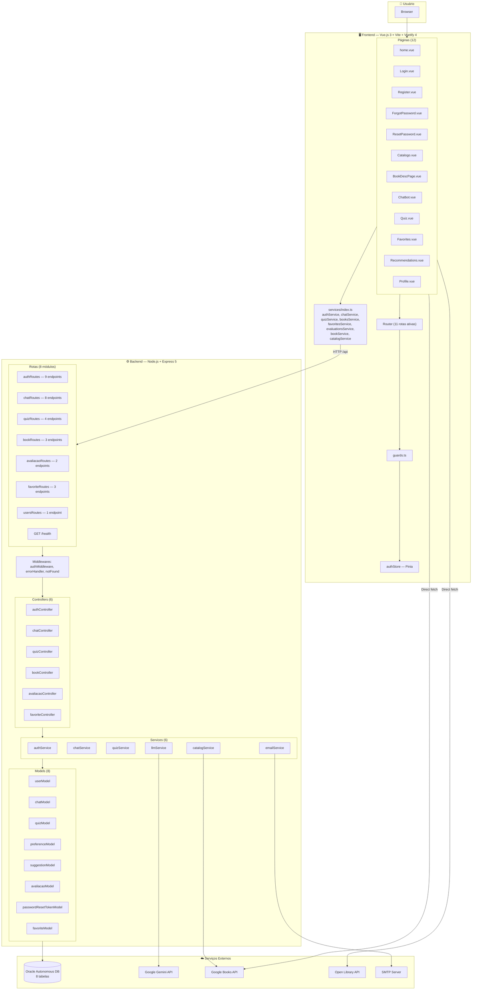
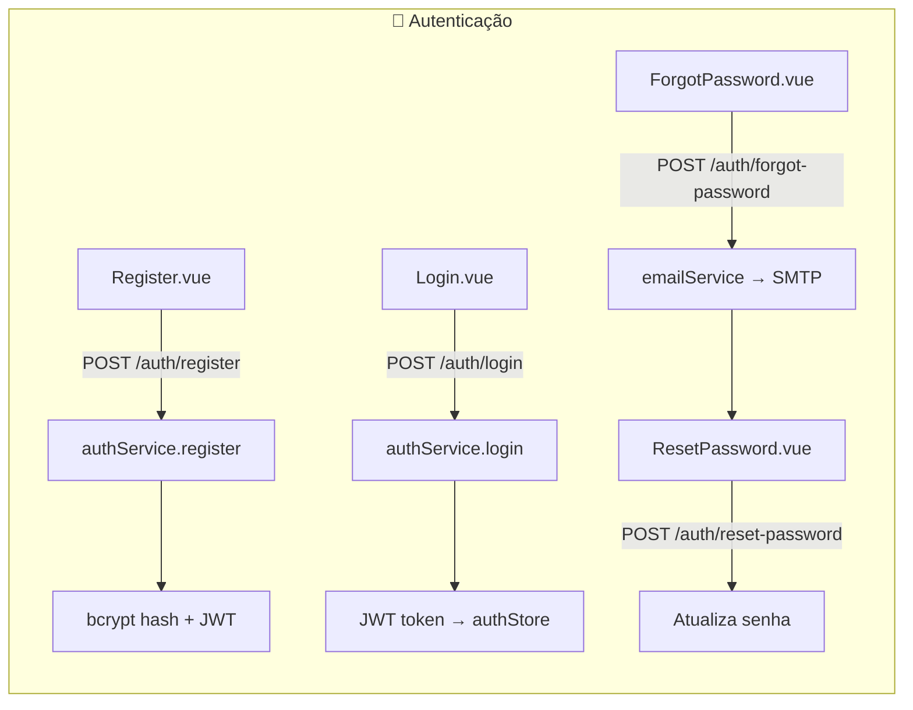
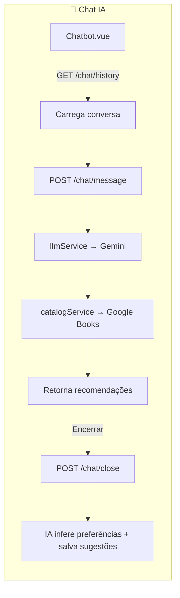
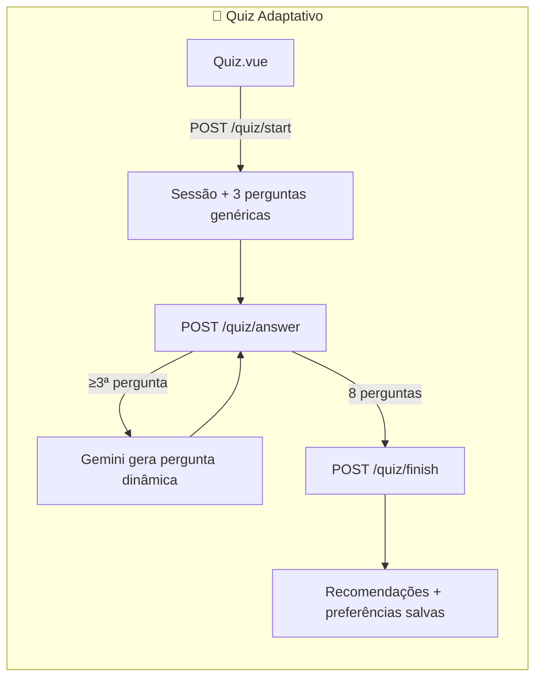
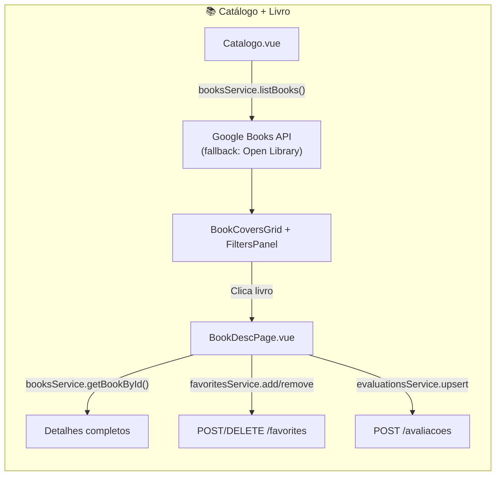
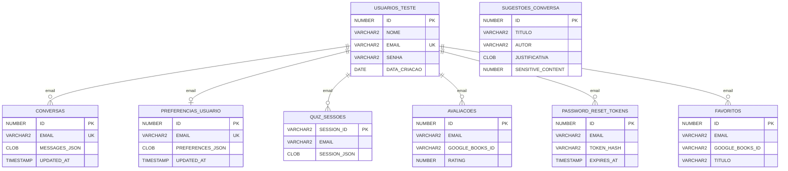

# 🗺️ Fluxograma — Projeto Entre Páginas (branch `main`)

## Arquitetura Geral

---

## Fluxos do Usuário

---

## Diagrama ER (Banco Oracle)

---

## ✅ Análise de Conexões Frontend ↔ Backend

| Funcionalidade | Frontend (Página) | Frontend (Service) | Backend (Rota) | Conectada? |
|---|---|---|---|---|
| Cadastro | Register.vue | `authService.register()` | POST /auth/register | ✅ |
| Login | Login.vue | `authService.login()` | POST /auth/login | ✅ |
| Esqueceu senha | ForgotPassword.vue | `authService.forgotPassword()` | POST /auth/forgot-password | ✅ |
| Redefinir senha | ResetPassword.vue | `authService.resetPassword()` | POST /auth/reset-password | ✅ |
| Verificação e-mail | Register.vue | `authService.sendCode/verifyCode()` | POST /auth/send-code, verify-code | ✅ |
| Perfil (ver/editar/deletar) | Profile.vue | `authService.me/updateMe/deleteMe()` | GET/PATCH/DELETE /auth/me | ✅ |
| Chat IA | Chatbot.vue | `chatService.*()` | POST/GET/DELETE /chat/* | ✅ |
| Preferências | Profile.vue | `chatService.getPreferences/update/clear()` | GET/PUT/DELETE /chat/preferences | ✅ |
| Sugestões salvas | Recommendations.vue | `chatService.getSuggestions()` | GET /chat/suggestions | ✅ |
| Quiz | Quiz.vue | `quizService.start/answer/regenerate/finish()` | POST /quiz/* | ✅ |
| Catálogo | Catalogo.vue | `booksService.listBooks()` | **Direto Google Books/Open Library** | ✅ (sem backend) |
| Detalhes livro | BookDescPage.vue | `booksService.getBookById()` | **Direto Google Books/Open Library** | ✅ (sem backend) |
| Favoritos | Favorites.vue | `favoritesService.*()` | GET/POST/DELETE /favorites | ✅ |
| Avaliações | BookDescPage.vue | `evaluationsService.*()` | GET/POST /avaliacoes | ✅ |
| Home → Quiz | home.vue | `router.push('/quiz')` | — | ✅ |
| Home → Chat | home.vue | `router.push(chatbotRoute)` | — | ✅ |
| Home → Search+Chat | home.vue | `startNewConversation()` | — | ✅ |
| Backend catálogo | — | `bookService.list()` | GET /books | ⚠️ Existe mas não é usado |

---

## 🚨 Status das correções

> [!WARNING]
> Problemas encontrados originalmente no código da `main` e status após correções:

| # | Item | Detalhe | Severidade |
|---|------|---------|------------|
| 1 | **Auth bypass ativo** | Corrigido: `guards.ts` usa `requiresAuth`/`guest` sem bypass | ✅ Corrigido |
| 2 | **Rota /preferencias** | Comentário removido do router; preferências continuam dentro de `Profile.vue` | ✅ Corrigido |
| 3 | **Rota /historico** | Comentário removido do router; página dedicada segue fora do escopo | ✅ Limpado |
| 4 | **Helmet** | Implementado em `src/middlewares/security.js` e aplicado em `src/app.js` | ✅ Corrigido |
| 5 | **Rate Limiting** | Implementado com limite global e limite específico para rotas de autenticação | ✅ Corrigido |
| 6 | **Payload 10MB** | Implementado via `express.json({ limit: env.jsonBodyLimit })`, default `10mb` | ✅ Corrigido |
| 7 | **Refresh Token** | Mantido simples: não implementado; a API usa JWT único com `JWT_EXPIRES_IN` | ✅ Decisão de escopo |
| 8 | **Carrossel Home** | PDF (RF05) descreve carrossel de categorias — **removido** na home atual | ⚠️ Design choice |

---

## 📋 Verificação PDF vs Código Real

### ✅ Informações CORRETAS no PDF
| Item | PDF | Código | ✅ |
|------|-----|--------|---|
| Vue.js 3 | 3.5.30 | `"vue": "^3.5.30"` | ✅ |
| Pinia | 3.0.4 | `"pinia": "^3.0.4"` | ✅ |
| Vue Router | 5.0.3 | `"vue-router": "^5.0.3"` | ✅ |
| Vuetify 4 | 4.0.2 | `"vuetify": "^4.0.2"` | ✅ |
| Tailwind CSS | 4.2.1 | `"tailwindcss": "^4.2.1"` | ✅ |
| Vite | 8.0.0 | `"vite": "^8.0.0"` | ✅ |
| Express.js 5 | 5.1.0 | `"express": "^5.1.0"` | ✅ |
| @google/generative-ai | 0.24.1 | `"^0.24.1"` | ✅ |
| bcrypt | 6.0.0 | `"^6.0.0"` | ✅ |
| jsonwebtoken | 9.0.2 | `"^9.0.2"` | ✅ |
| nodemailer | 8.0.7 | `"^8.0.7"` | ✅ |
| oracledb | 6.9.0 | `"^6.9.0"` | ✅ |
| nodemon | 3.1.14 | `"^3.1.14"` | ✅ |
| Pool conexões | min 1, max 5 | env.js: `POOL_MIN=1, POOL_MAX=5` | ✅ |
| CORS restrito | Variáveis env | `cors({ origin: env.corsOrigin })` | ✅ |
| Fontes | Roboto, Playfair Display | package.json do frontend | ✅ |

### ⚠️ Informações DIVERGENTES no PDF
| Item | PDF diz | Código real | Status |
|------|---------|-------------|--------|
| Modelo Gemini | `gemini-1.5-flash / gemini-2.0-flash` | `gemini-2.5-flash-lite` (env.js L24) | ⚠️ Divergente |
| JWT expiração | `15 min + Refresh Token 7 dias` | Default `1h`, JWT único sem refresh token | ⚠️ Divergente |
| `npm run db:init` | Script unificado | `npm run db:setup` (nome diferente) | ⚠️ Nome diferente |
| Tabelas no banco | 7 tabelas | 8 tabelas (+ FAVORITOS) | ⚠️ PDF desatualizado |

### ✅ Itens agora implementados no código
| Item | PDF afirma | Realidade |
|------|-----------|-----------|
| **Helmet** | Headers de segurança implementados | Implementado com `helmet()` |
| **Rate Limiting** | 3 níveis (global, brute force, por usuário) | Implementado com limite global e limite específico para autenticação |
| **Payload 10MB** | Limite configurado | Implementado via `JSON_BODY_LIMIT`, default `10mb` |

---

## 📊 Resumo Final

### ✅ O que está BEM na `main`
- **12 páginas no frontend** (vs 5 na branch anterior) — todas as principais implementadas
- **8 módulos de rotas** no backend com **30+ endpoints**
- **Frontend services completos**: auth, chat, quiz, books, favorites, evaluations — **todos conectados**
- **Integração dupla de catálogo**: Google Books + Open Library como fallback
- **Fluxo completo**: registro → verificação email → login → home → chat/quiz/catálogo → perfil
- **8 models** cobrindo todas as entidades do banco

### 🔴 Itens críticos para corrigir
1. **Atualizar o PDF**: modelo Gemini, JWT único, tabela FAVORITOS e comando `npm run db:setup`
2. **Decidir produto/UI**: manter a home sem carrossel ou reimplementar o RF05 em um plano separado
